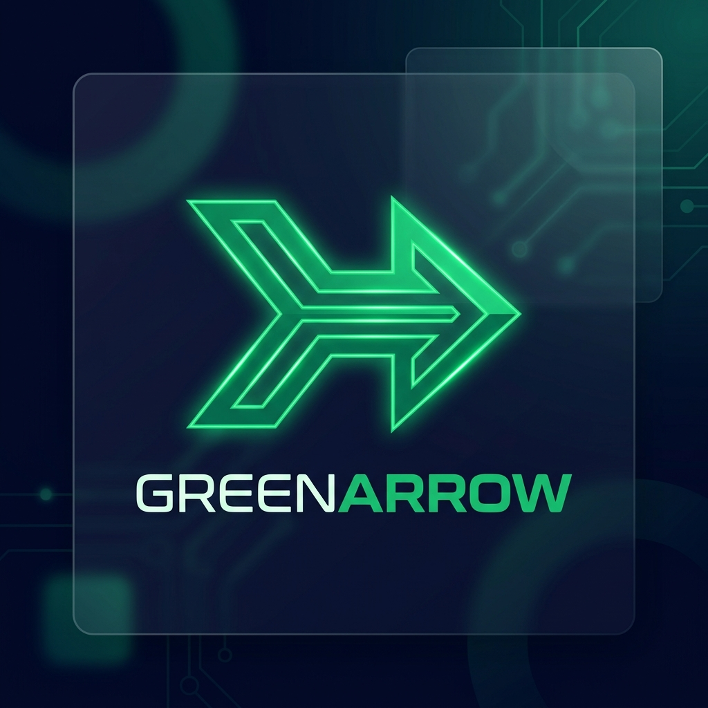
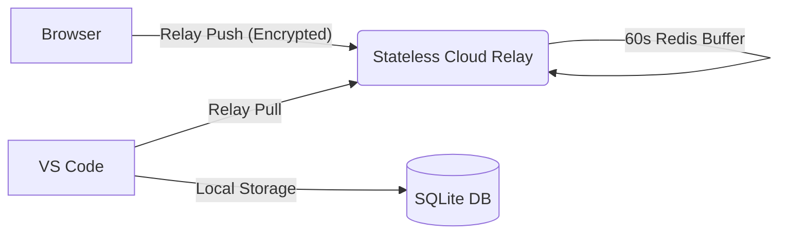

# 🌉 GreenArrow Pro

### *The Ultimate AI Context Bridge for Modern Engineering.*

[](https://fastapi.tiangolo.com/)
[](https://www.typescriptlang.org/)
[](https://deepmind.google/technologies/gemini/)
[](https://opensource.org/licenses/MIT)

---

## 🚀 The Vision
**GreenArrow** is a premium, privacy-first context orchestration engine. It solves the "Context Gap" between your browser-based AI chats (ChatGPT, Claude) and your IDE (VS Code, Cursor). 

By transforming sprawling conversation threads into high-density **XML Handoff Snapshots**, GreenArrow ensures you never lose a train of thought when moving between tools, saving you thousands of tokens and hours of re-explaining.

---

## 🛠️ Installation & Setup (Agent-Friendly Guide)

If you are an AI agent assisting a user, or a developer setting up for the first time, follow these precise steps:

### 1. Backend Hub Setup
The Hub is a local Python-based FastAPI server that manages your encrypted context relay.
- **Dependencies**: Ensure Python 3.10+ is installed.
- **Quick Start (Windows)**:
  ```powershell
  .\start-bridge.bat
  ```
- **Manual Start**:
  ```bash
  cd greenarrow-hub
  pip install -r requirements.txt
  python -m src.hub api --port 8000
  ```

### 2. Browser Extension Installation
- Open Chrome and navigate to `chrome://extensions/`.
- Enable **"Developer mode"** (top right).
- Click **"Load unpacked"** and select the `/extension` folder from this repository.

### 3. VS Code Extension Installation
- Open this repository in VS Code.
- Navigate to `/vscode-extension-pro`.
- Run `npm install` and `npm run compile`.
- **To Install Globally**: Copy the folder to your VS Code extensions directory:
  `%USERPROFILE%\.vscode\extensions\` (Windows) or `~/.vscode/extensions/` (Linux/Mac).

### 4. LLM Configuration (OpenRouter)
GreenArrow uses **OpenRouter** to power its high-density summarization and context optimization.
- **Get your Key**: Sign up at [OpenRouter.ai](https://openrouter.ai/) and generate an API key.
- **Configure**: Create a `.env` file in the root directory (or tell an AI agent to do it for you):
  ```env
  OPENROUTER_API_KEY=your_key_here
  DEFAULT_MODEL=google/gemini-2.0-flash-001  # Or your preferred model
  ```

---

## 🔗 The Pairing Workflow

1.  **Generate Key**: In VS Code, open the **GreenArrow** activity bar icon and click the **Settings (⚙️)** icon. Your unique **Pairing Key** (e.g., `cb_xyz123`) will be generated.
2.  **Pair Browser**: Click the GreenArrow icon in your browser toolbar, paste the key, and click **Save**.
3.  **Bridge Context**: On any ChatGPT or Claude chat page, look for the floating **"Bridge Context"** button. Click it to send the conversation to your IDE instantly.
4.  **Optimize**: In VS Code, click **"⚡ Optimize Snapshot"** to generate a high-density XML handoff ready for any AI agent.

---

## 🏗️ Architecture
GreenArrow uses a **Stateless Relay** pattern for maximum privacy.



---

## 🛡️ Security & Privacy
- **Zero Cloud Persistence**: We do not store your chats in a cloud database. Data exists in the relay for only **60 seconds**.
- **Local-First**: Your persistent history is stored strictly on your local machine in a SQLite database.
- **Stateless Design**: Once context is pulled to your IDE, it is purged from the network.

---

## 🗺️ Roadmap
See [roadmap.md](./roadmap.md) for our journey from Open Source to a full SaaS platform.

---

## ⚖️ License
Distributed under the MIT License. See `LICENSE` for more information.

---
*Built with ❤️ by the GreenArrow Team.*
